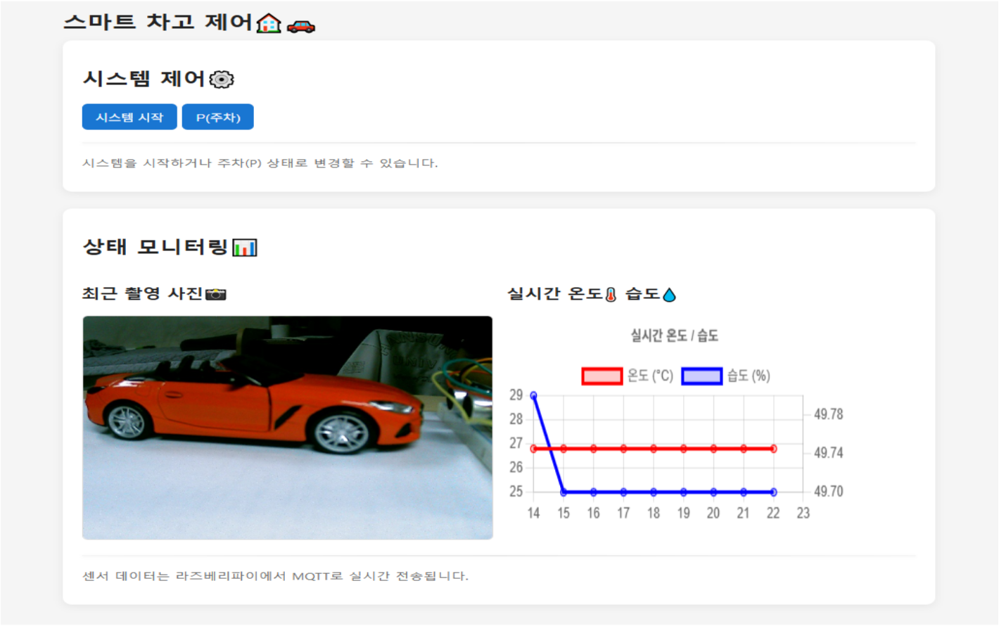
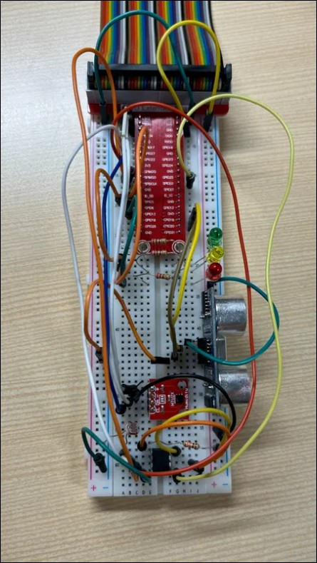
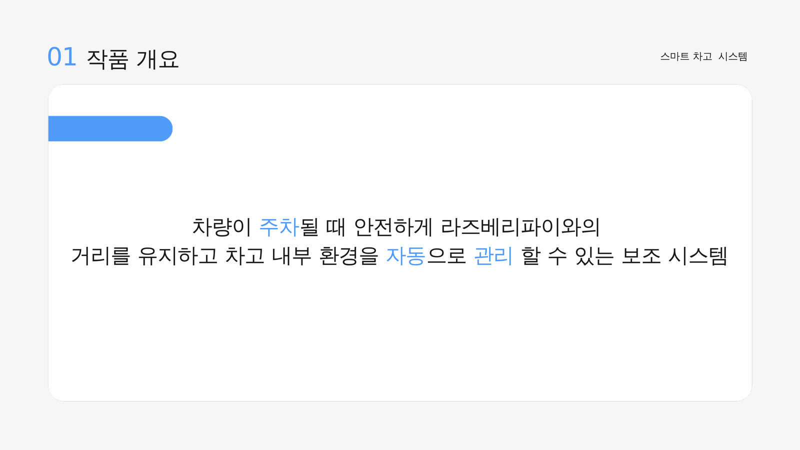
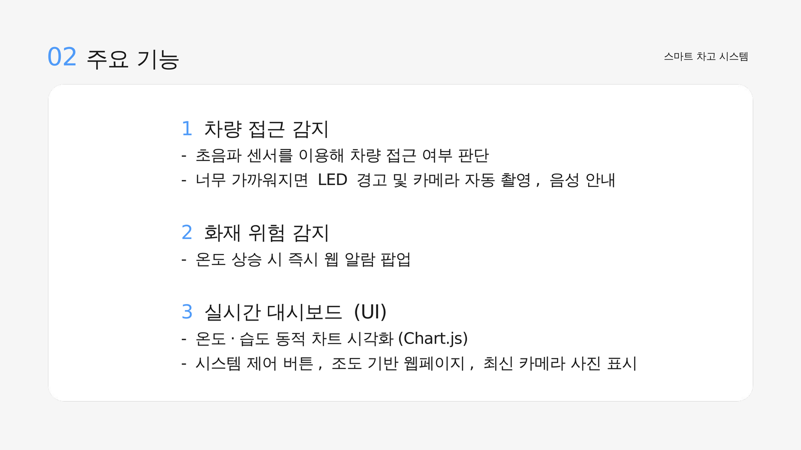
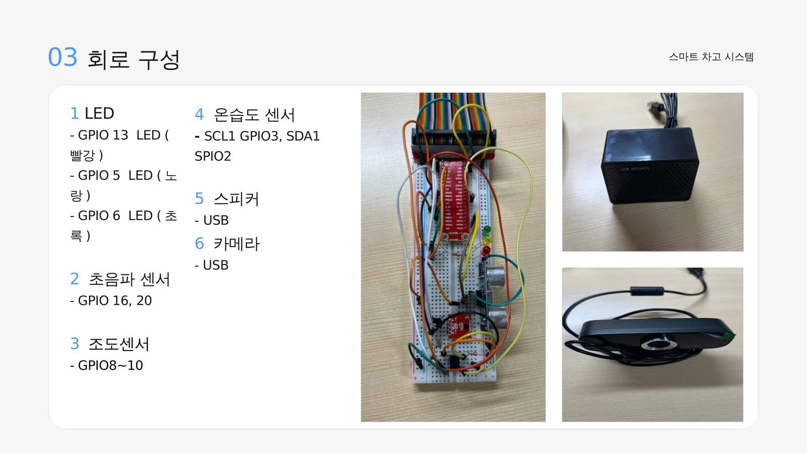
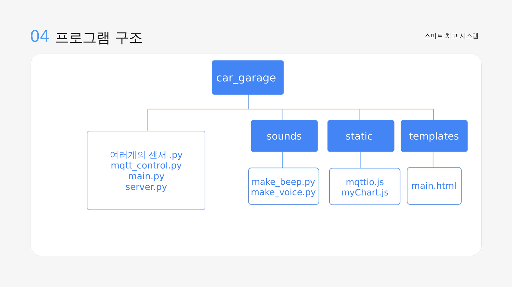
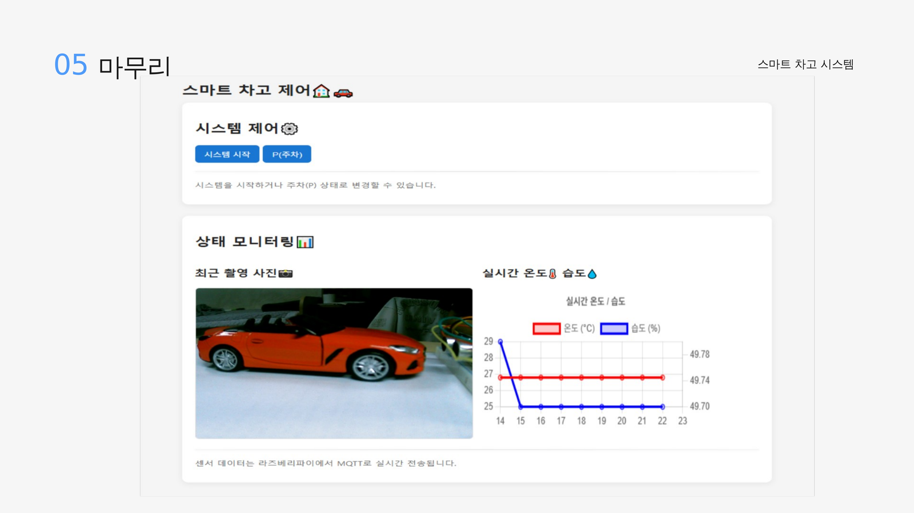

# 🚗 스마트 차고 제어 시스템

> 라즈베리파이 기반 차량 접근 감지 및 차고 환경 모니터링 보조 시스템

---

### 🎥 시연 영상
## ▶️ [Watch on YouTube](https://www.youtube.com/watch?v=E-3C_M_Prd8)

[](https://www.youtube.com/watch?v=E-3C_M_Prd8)

---

## 📋 작품 설명

### 💬 개발 개요
#### 1. 개발 배경 및 필요성

&nbsp;&nbsp;차고에 차량을 주차할 때는 벽이나 장애물과의 거리를 가늠하기 어려워 접촉 사고가 발생하기 쉽고, 차고 내부는 사람이 계속 지켜보지 않는 이상 온도 상승 같은 이상 상황을 바로 알아채기 어렵다. 이런 문제를 해결하기 위해 센서로 차량 접근과 차고 환경을 자동으로 감지하고, 그 결과를 웹에서 바로 확인할 수 있는 보조 시스템이 필요했다.

#### 2. 개발 목표

> 초음파 센서로 차량과의 거리를 실시간으로 측정해 안전한 주차를 돕고, 온습도·조도 센서로 차고 내부 환경을 자동으로 감지해 웹 대시보드로 실시간 확인할 수 있는 스마트 차고 보조 시스템을 구현하는 것을 목표로 한다.

<p align="center">
  
</p>

* 초음파 센서로 차량 접근을 감지해 **LED·경고음·음성으로 즉시 안내**
* 온도 상승 시 **화재 위험 경고 팝업**을 웹 대시보드에 표시
* MQTT 통신으로 센서 데이터를 **웹 대시보드에 실시간 전송**
* 조도 센서 값에 따라 웹 페이지가 **라이트/다크 모드로 자동 전환**
* 차량 근접 시 **카메라 자동 촬영**으로 사진 기록

#### 3. 세부 개발 목표

- **3단계 거리 기반 경고**  
  거리에 따라 LED 점등 개수(1~3개)와 경고음 속도를 다르게 하여 위험도를 직관적으로 전달한다.

- **온도 기반 화재 위험 감지**  
  온습도 센서로 28℃ 이상을 감지하면 LED 경고와 함께 웹 대시보드에 팝업 알림을 띄운다.

- **MQTT 기반 실시간 통신**  
  라즈베리파이에서 측정한 센서 값을 MQTT로 발행해, 웹 대시보드가 지연 없이 값을 수신하고 그래프에 반영한다.

- **웹 기반 원격 제어**  
  Flask 웹 서버를 통해 별도 프로그램 설치 없이 브라우저에서 시스템 시작/정지(P 모드)를 제어한다.

---

### ⚙️ 개발 환경 설명
#### 1. 하드웨어 구성

* 라즈베리파이
  * 초음파 센서 (GPIO 16, 20) — 차량과의 거리 감지
  * 온습도 센서 HTU21D (SCL1 GPIO3, SDA1 GPIO2) — 화재 위험 감지
  * 조도 센서 MCP3008 (GPIO 8~10) — 주변 밝기 감지
  * LED 3개 (GPIO 5, 6, 13) — 거리·온도 상태 표시
  * USB 카메라 — 차량 근접 시 자동 촬영
  * USB 스피커 — 경고음 및 음성 안내 출력

<p align="center">
  
</p>

#### 2. 소프트웨어 구성

* **메인 시스템 (`main.py`)**: 센서 값을 주기적으로 읽어 LED, 사운드, 카메라를 제어하는 라즈베리파이 상의 메인 루프
* **MQTT (`mqtt_control.py` + Mosquitto 브로커)**: 센서 데이터 발행/구독과 웹의 start/stop 제어 신호 수신
* **웹 대시보드 (`server.py`, `templates/`, `static/`)**: Flask로 페이지를 서빙하고, Chart.js로 실시간 온습도 그래프를 표시하며, 조도 값에 따라 라이트/다크 테마를 자동 전환

#### 3. 차량 접근 감지 및 알림 흐름

1) 초음파 센서가 주기적으로 거리를 측정
2) 거리 구간(20cm / 15cm / 8cm 이하)에 따라 LED 점등 개수와 경고음 속도가 달라짐
3) 8cm 이내로 근접하면 카메라가 사진을 촬영하고 MQTT로 갱신 이벤트를 전송
4) 웹 대시보드가 이벤트를 수신해 최신 사진을 자동으로 갱신

#### 4. MQTT 기반 센서 데이터 전송 흐름

1) `main.py`가 1초 주기로 온습도·조도 값을 MQTT로 publish
2) 브라우저의 `mqttio.js`가 MQTT 웹소켓으로 값을 구독
3) 값을 수신하면 Chart.js 그래프를 갱신하고, 온도가 28℃ 이상이면 경고 팝업을 표시
4) 조도 값에 따라 페이지가 자동으로 라이트/다크 모드로 전환

---

### 📝 개발 프로그램 설명
#### 1. 파일 구성

<details>
<summary><b>메인 시스템 (센서 · LED · 사운드 · 카메라 제어)</b></summary><br>

- `main.py` — 전체 시스템 메인 루프, 센서 값을 읽어 LED/사운드/카메라 제어
- `distance_sensor.py` — 초음파 거리 센서 제어
- `led_system.py` — LED 3개 제어 (거리/온도 기반)
- `temp_sensor.py` — 온습도 센서(HTU21D) 제어
- `light_sensor.py` — 조도 센서(MCP3008) 제어
- `camera_system.py` — 카메라 촬영 및 이미지 저장 (OpenCV)
- `sound_system.py` — 경고음/음성 안내 재생 (pygame)
</details>

<details>
<summary><b>MQTT 통신</b></summary><br>

- `mqtt_control.py` — MQTT 발행/구독 및 start/stop 제어 로직
</details>

<details>
<summary><b>웹 대시보드</b></summary><br>

- `server.py` — Flask 웹 서버, 대시보드 페이지 및 시작/정지 API
- `templates/main.html` — 대시보드 메인 페이지
- `static/mqttio.js` — MQTT 웹소켓 클라이언트, 테마 전환 로직
- `static/myChart.js` — Chart.js 온습도/습도 그래프
</details>

<details>
<summary><b>사운드 리소스</b></summary><br>

- `sounds/beep.wav` — 경고음
- `sounds/car_detected.mp3` — "차량이 감지되었습니다" 음성
- `sounds/too_close.mp3` — "정지하세요" 음성
- `sounds/make_beep.py` — 경고음(wav) 생성 스크립트
- `sounds/make_voice.py` — 음성 안내(mp3) 생성 스크립트 (gTTS)
</details>

#### 2. 실행 방법

```bash
# 라이브러리 설치
pip install flask paho-mqtt opencv-python pygame gTTS \
            RPi.GPIO Adafruit-GPIO Adafruit-MCP3008 \
            adafruit-circuitpython-htu21d adafruit-blinka

# 1. MQTT 브로커 실행 (Mosquitto, 웹소켓 9001 포트 활성화)
mosquitto -c mosquitto.conf

# 2. 센서/LED/카메라/사운드 메인 루프 실행 (라즈베리파이에서)
python main.py

# 3. 웹 대시보드 서버 실행
python server.py
```

브라우저에서 `http://<라즈베리파이 IP>:8080` 접속하면 대시보드에서 시스템 시작/정지, 실시간 온습도 그래프, 최신 촬영 사진을 확인할 수 있다.

---

## 🖥️ 개발 언어
<span>
  
  
  
  
</span>

## 🖥️ 개발 도구 / 라이브러리
<span>
  
  
  
  
  
</span>

---

## 📄 발표 자료

PPT 파일 용량이 커서 바로 미리보기가 되지 않아, 슬라이드를 이미지로 캡처해 아래에 첨부합니다.

<p align="center">
  
</p>
<p align="center">
  
</p>
<p align="center">
  
</p>
<p align="center">
  
</p>
<p align="center">
  
</p>
<p align="center">
  
</p>

📄 전체 원본 파일: [`스마트 차고 제어 시스템.pptx`](./스마트%20차고%20제어%20시스템.pptx)
